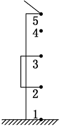
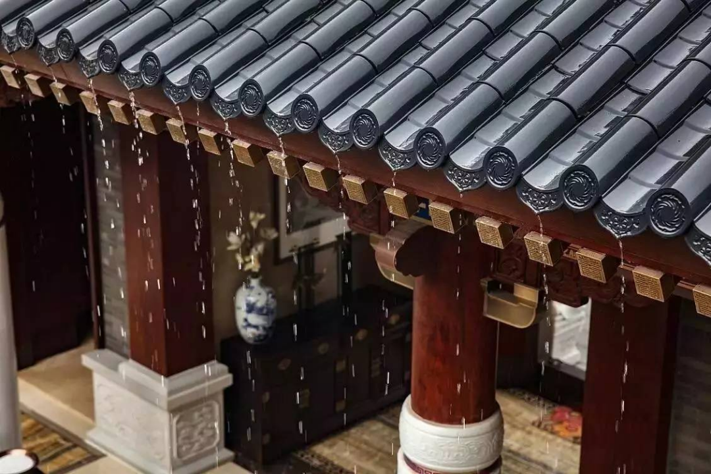
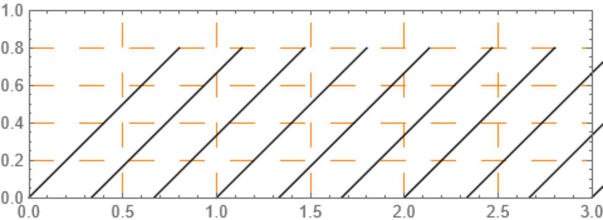

## 自由落体公式

$$
h=\frac{1}{2}gt^2
$$

$$
v=gt
$$

$$
v^2=2gh
$$

$$
h=\frac{v}{2}t
$$

## 能力提升
****
### 例题1
【例题】屋檐上每隔一定时间滴下一滴水，当第5滴正欲滴下时，第1滴刚好落到地面，而第3滴与第2滴分别位于高1 m的窗子的上、下沿，如图所示。问：(g取10 $m/s^2$)
⑴此屋檐离地面多高？   
⑵滴水的时间间隔是多少？

设滴水的时间间隔是T，屋檐离地面高度为H。
解法一：基本法
第2个水滴离地高度:  $h_1=\frac{1}{2}g(3T)^2$
第3个水滴离地高度:  $h_2=\frac{1}{2}g(2T)^2$
$h_1-h_2=1m$
解得  T=0.2s
$H=\frac{1}{2}g(4T)^2=3.2m$

解法二：比例关系
自由落体是初速度为0的匀加速运动，满足
$h_{5-4}:h_{4-3}:h_{3-2}:h_{2-1}=1:3:5:7$
$h_{3-2}=1m$
$\rightarrow  H=\frac{16}{5}m$

解法三：平均速度=中间时刻速度
3-2水滴平均速度$\bar{v}=\frac{1}{T}$
$v_{2.5T末}=2.5gT$
$\bar{v}=v_{2.5T末}$
解得   T=0.2s

****
### 例题2
参观古镇时，恰逢下雨，小吴同学饶有兴致地观察屋檐滴水的情景，他观察到滴水中水滴下落时间间隔均匀，测得1分钟内下落水滴180个，由参观资料知屋檐高为3.2m。不计空气阻力，重力加速度g取，他有以下推断，其中正确的是（　　）

A. 空中相邻的两个水滴的间距保持不变

B. 空中相邻的两个水滴的之间的最大间距是$\frac{5}{3}m$

C. 空中有3个水滴时相邻间距之比始终为1：3

D. 空中有3个水滴和2个水滴的时间之比是2：3

看下图分析，某时刻与t=1.0s,t=1.0这条竖线与3条斜线有3个交点，此时空中有3个水滴。若有2个交点则代表空中有2个水滴。

水滴从释放到落地时间:$t=\sqrt{\frac{2h}{g}}=0.8s$,

相邻两个水滴时间间隔 $\frac{1}{3} s$,

随便取一段$t=1.0 s 至 t=1+\frac{1}{3} s$ 观察:

$1.0s 至 \frac{1}{3}+0.8 s=\frac{2}{15}s$有3滴水滴;

则2滴水滴时间为:$(\frac{1}{3}-\frac{2}{15})s=\frac{3}{15}s$

****